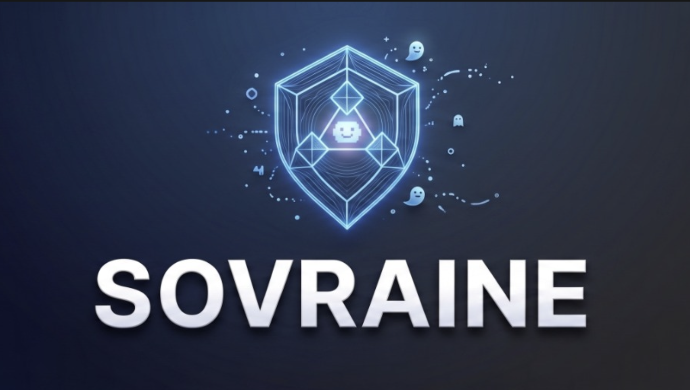
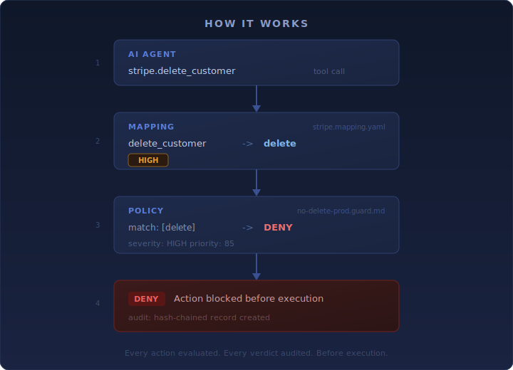

<p align="center">
  
</p>

<p align="center">
  <strong>The governance layer between AI agents and the tools they call.</strong>
</p>

<p align="center">
  <a href="LICENSE"></a>
  <a href="https://github.com/Sovraine/open-guard-hub/releases"></a>
  <a href="CONTRIBUTING.md"></a>
</p>

---

AI agents act autonomously. One hallucinated tool call in production, and the damage is done before anyone notices.

OpenGuard Hub is a **community registry** of governance artifacts -- action verbs, security policies, agent definitions, and MCP server mappings -- that any AI agent framework can use to **evaluate every action before it executes**.

- **676 verbs** across 18 industry sectors
- **104 MCP server mappings** covering 2,100+ tools
- **63 governance policies** ready to enforce
- **18 agent definitions** with risk ceilings and verb access control

## What's Inside

| Directory | Content | Count |
|-----------|---------|-------|
| `core/` | Cross-sector verb definitions | 9 domains, 165 verbs |
| `sectors/` | Industry-specific verbs | 18 sectors, 512 verbs |
| `policies/` | Governance policies (`.guard.md`) | 63 |
| `mappings/` | MCP server action mappings (`.mapping.yaml`) | 104 servers, 2,100+ tools |
| `agents/` | Agent definitions (`.agent.md`) | 18 |
| `souls/` | Agent personas (`.soul.md`) | 19 |
| `skills/` | Atomic capabilities (`.skill.md`) | 7 |
| `gates/` | Kubernetes admission policies | 13 |
| `spec/` | OGS format specification | 7 docs |

## How It Works

Every AI agent action maps to a **verb** in the taxonomy. Verbs carry risk levels. Policies match verbs and return verdicts. The runtime enforces them before the tool executes.

<p align="center">
  
</p>

Hub content feeds into the [Sovraine](https://sovraine.io) governance engine, but the taxonomy and policies are open and usable by any framework.

## Quick Start

```bash
# Clone the hub
git clone https://github.com/Sovraine/open-guard-hub.git
cd open-guard-hub

# Browse the taxonomy
cat core/common/_verbs.yaml       # Universal verbs (create, read, update, delete, ...)
ls sectors/                       # 18 industry sectors
ls mappings/                      # 104 MCP server mappings

# Validate with the scanner
sovctl guard scan .               # 126 automated checks, Grade A required
```

## 18 Industry Sectors

| Sector | Status | | Sector | Status |
|--------|--------|-|--------|--------|
| financial-services | STABLE | | retail-ecommerce | BETA |
| healthcare | STABLE | | logistics | BETA |
| legal | STABLE | | energy-utilities | BETA |
| human-resources | STABLE | | telecom | BETA |
| professional-services | STABLE | | manufacturing | BETA |
| saas-tech | STABLE | | real-estate | BETA |
| cybersecurity | BETA | | automotive | BETA |
| public-sector | BETA | | media-entertainment | BETA |
| education | BETA | | hospitality | BETA |

## OGS Specification

The [OpenGuard Specification](spec/) defines the file formats:

- [GuardFile](spec/guardfile.md) -- `.guard.md` policy format
- [Agent](spec/agent.md) -- `.agent.md` agent definition
- [Soul](spec/soul.md) -- `.soul.md` persona/system prompt
- [Skill](spec/skill.md) -- `.skill.md` capability definition
- [Mapping](spec/mapping.md) -- `.mapping.yaml` MCP tool translation
- [Taxonomy](spec/taxonomy.md) -- `_verbs.yaml` / `_sector.yaml` format

## Contributing

See [CONTRIBUTING.md](CONTRIBUTING.md) for the full guide. Contributions require a [DCO sign-off](DCO), not a CLA.

**Using Claude Code?** Type `/contributor-onboard` for an interactive guide. See [AGENTS.md](AGENTS.md) for all available AI-assisted skills.

### What you can contribute

- **Policies** -- governance rules for specific use cases (`.guard.md`)
- **Mappings** -- translate MCP server tools to taxonomy verbs (`.mapping.yaml`)
- **Agents** -- define agent personas with verb access control (`.agent.md`)
- **Verbs** -- extend the taxonomy for your industry sector
- **Skills** -- atomic capabilities that expand agent permissions (`.skill.md`)

CI validates every PR automatically: 13 content security checks + 126 GUARD scanner checks. Grade A required to merge.

## License

Hub content is licensed under [CC-BY-SA-4.0](LICENSE).
OGS specification is licensed under [CC-BY-4.0](spec/README.md).

---

Built by [Sovraine](https://sovraine.io) -- AI agent safety governance.
